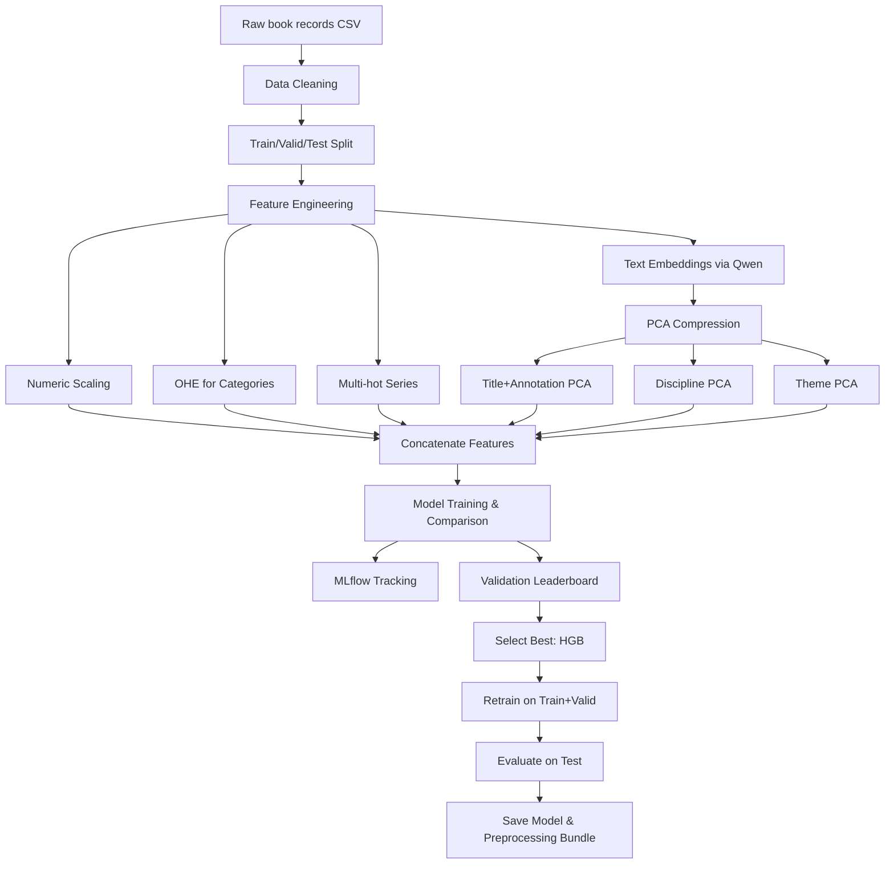

# Knorus Price Prediction

## Overview

A price prediction pipeline for academic books published by Knorus. We inspect raw metadata (title, annotation, discipline, format, pages, etc.), clean and encode all fields, generate semantic embeddings with `Qwen3.5-0.8B`, compress them with PCA, compare several regression models under MLflow, and save the best model for production use.



## Dataset
 
The dataset [`pymlex/knorus-price-list`](https://huggingface.co/datasets/pymlex/knorus-price-list) contains **8,188** book records.

## Target and feature design

The target is `Цена (руб.)`, modelled in `log1p(price)` space to reduce skew and handle expensive books not as outliers. Uninformative columns are dropped: `Код издания`, `Автор`, `ISBN`, `Ссылка на ЭБС`. The remaining fields are processed as follows:

* `Название` – core title extracted and merged with `Аннотация` into a single semantic block.
* `Гриф` is a binary flag.
* `Обл/пер` is also a 0/1 feature.
* `Год издания`, `Кол-во страниц` – numeric, standardized.
* `Формат` – split into three numeric parts (width, height, denominator).
* `Вид издания` and `Издательство` – one‑hot encoded.
* `Серия` – multi‑hot encoding.
* `Дисциплина` and `Тематика` – embedded with Qwen `Qwen/Qwen3.5-0.8B-Base`, row‑wise averaged, then compressed with PCA 64 components each.
* `Название + Аннотация` – embedded with the same Qwen model, compressed to 128 components after checking 95% explained variance.

### Target distribution


### Annotation length


### Train / valid / test split

Stratified on 10 price bins.

| Split      | Samples |
|------------|--------:|
| Train      |   7,368 |
| Validation |     205 |
| Test       |     615 |

## Feature engineering

### Text normalisation

* `title_core` – trailing period‑separated suffix removed.
* `title_annotation_text` – `Title: … \n Annotation: …` composite string.
* `Формат` – parsed into `format_w`, `format_h`, `format_n`.
* `Гриф` – binary (0 = “Без грифа” or missing, 1 otherwise).
* `Обл/пер` – binary (0 = “Обложка”, 1 = “Переплет”).
* `Дисциплина`, `Тематика`, `Серия` – split on `;`.

### Embeddings & PCA

`Qwen3.5-0.8B` is a base pre-trained SLM. Its embeddings are obtained via mean pooling of the last hidden state. We cache every unique text to avoid recomputation. Three PCA analyses were run on the training embeddings to decide component counts. The 95% explained‑variance thresholds were:

| Block                  | Components for 95% | Chosen |
|------------------------|-------------------:|-------:|
| Title + Annotation     |                304 |    128 |
| Discipline             |                279 |     64 |
| Theme                  |                 63 |     64 |

`Title + Annotation` PCA explained variance:


### Final feature vector

376 features composed of:

* 5 numeric (year, pages, format‑w, format‑h, format‑n)
* 24 edition type OHE
* 5 publisher OHE
* 2 binary (grif, cover)
* 84 multi‑hot series
* 128 title‑annotation PCA
* 64 discipline PCA
* 64 theme PCA

## Models

All models predict `log1p(price)` and metrics are reported in original price space (RUB). A constant median predictor serves as baseline.

### Validation leaderboard

| Model         |     MAE |    RMSE |     R² |
|---------------|--------:|--------:|-------:|
| **HGB**       |   96.86 | 192.60  | 0.7870 |
| Random Forest |   96.67 | 204.67  | 0.7594 |
| ElasticNet    |  117.10 | 204.84  | 0.7590 |
| Ridge         |  117.55 | 205.42  | 0.7577 |
| Stack (linear)|  117.37 | 205.84  | 0.7567 |
| MLP (torch)   |  129.39 | 213.78  | 0.7375 |
| Median (baseline) | 276.14 | 435.80 | -0.0907 |

HistGradientBoostingRegressor (`hgb`) was the winner on the validation set.

### 5‑fold cross‑validation for top‑2 models

HGB and Random Forest were further evaluated with 5‑fold CV on the training part.

**HGB**

| Fold |    MAE |   RMSE |     R² |
|------|-------:|-------:|-------:|
| 1    |  96.42 | 202.85 | 0.7391 |
| 2    |  95.72 | 201.06 | 0.7542 |
| 3    |  89.95 | 170.18 | 0.7978 |
| 4    |  94.55 | 195.30 | 0.7733 |
| 5    |  96.26 | 184.39 | 0.7742 |
| **Mean** | **94.58** | **190.76** | **0.7677** |

**Random Forest**

| Fold |    MAE |   RMSE |     R² |
|------|-------:|-------:|-------:|
| 1    |  91.02 | 207.82 | 0.7261 |
| 2    |  89.84 | 197.53 | 0.7628 |
| 3    |  87.03 | 175.68 | 0.7845 |
| 4    |  89.90 | 197.71 | 0.7677 |
| 5    |  91.90 | 185.52 | 0.7714 |
| **Mean** | **89.94** | **192.85** | **0.7625** |

HGB maintains the lead with a mean RMSE of 190.76.

### MLP training curves

The torch MLP (SwiGLU blocks, Huber loss) was trained for 36 epochs with early stopping. Validation RMSE improved but did not surpass tree‑based models.


## Final model

**HistGradientBoostingRegressor** (`learning_rate=0.05`, `max_depth=6`, `max_iter=500`) is retrained on the union of train and validation sets and evaluated on the held‑out test split.

| Metric | Value   |
|--------|--------:|
| MAE    | 102.69  |
| RMSE   | 233.74  |
| R²     | 0.7216  |

### Test set evaluation plots


## Inference

```python
import joblib
import numpy as np

bundle = joblib.load("models/preprocess_bundle.joblib")
model = joblib.load("models/final_model.joblib")

features = np.array([...], dtype=np.float32).reshape(1, -1)
log_price = model.predict(features)
price = np.expm1(log_price)
print(price)
```
